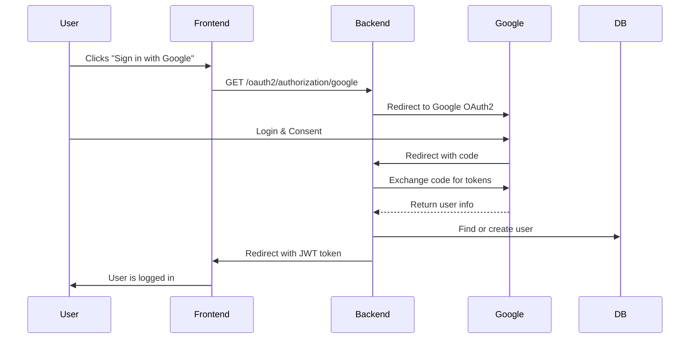

# Authentication Server

## 🗂️ Use Case Diagram

```mermaid
usecase
  actor User
  actor Admin
  User -- (Sign Up)
  User -- (Sign In)
  User -- (Sign In with Google)
  User -- (Sign In with GitHub)
  User -- (2FA Setup)
  User -- (2FA Verify)
  User -- (Forgot Password)
  User -- (Reset Password)
  User -- (View Profile)
  User -- (Sign Out)
  Admin -- (View Dashboard)
  Admin -- (Manage Users)
  Admin -- (Reset User 2FA)
  Admin -- (System Cleanup)
  Admin -- (Manage Configurations)
```

## 🧩 Sequence Diagram: Google OAuth2 Login



---

# 🔐 Authentication Server

A comprehensive Spring Boot authentication server with JWT, OAuth2, Two-Factor Authentication, and flexible multi-database support.

## ✨ Features

- 🔑 **JWT Authentication** - Secure token-based authentication with refresh tokens
- 🔐 **OAuth2 Integration** - Google, GitHub, and other providers
- 📱 **Two-Factor Authentication (2FA)** - TOTP with QR codes and backup codes
- 📧 **Email Verification** - Account verification and password reset
- 🗄️ **Multi-Database Support** - PostgreSQL, MySQL, MongoDB, H2
- ⚙️ **YAML Configuration** - Flexible, environment-based configuration system
- 🛡️ **Security Features** - Rate limiting, account lockout, session management
- 📊 **Admin Dashboard** - User management and system monitoring
- 🔄 **Refresh Tokens** - Secure token renewal mechanism
- 📱 **RESTful API** - Comprehensive API with full documentation
- 🐳 **Docker Support** - Easy containerized deployment
- 🔧 **Interactive Setup** - Database configuration wizards

## 🚀 Quick Start

### Option 1: Default Setup (H2 Database)
```bash
# Clone the repository
git clone <repository-url>
cd Authentication

# Run with default H2 database
mvn clean spring-boot:run
```

### Option 2: Interactive Database Setup
```bash
# Windows (PowerShell)
.\setup-database.ps1

# Linux/Mac (Bash)
chmod +x setup-database.sh
./setup-database.sh

# Then run the application
mvn clean spring-boot:run
```

### Option 3: Environment Variables
```bash
export DATABASE_TYPE=postgresql
export DATABASE_HOST=localhost
export DATABASE_USERNAME=postgres
export DATABASE_PASSWORD=your_password

mvn clean spring-boot:run
```

## 🌐 Access Points

| Service | URL | Description |
|---------|-----|-------------|
| **API Base** | http://localhost:4554/api | Main API endpoints |
| **Health Check** | http://localhost:4554/actuator/health | Application health status |
| **H2 Console** | http://localhost:4554/h2-console | Database console (H2 only) |
| **API Documentation** | Available in `API.md` | Complete endpoint documentation |

## 🗄️ Database Support

### Supported Databases

| Database | Status | Best For | Setup Difficulty |
|----------|--------|----------|------------------|
| **H2** | ✅ Default | Development, Testing | ⭐ Easy |
| **PostgreSQL** | ✅ Recommended | Production | ⭐⭐ Medium |
| **MySQL** | ✅ Supported | Production | ⭐⭐ Medium |
| **MongoDB** | 🔄 Available | NoSQL Applications | ⭐⭐⭐ Advanced |

### Quick Database Configuration

#### H2 (Default - No Setup Required)
```yaml
app:
  database:
    type: h2
```

#### PostgreSQL (Recommended for Production)
```yaml
app:
  database:
    type: postgresql
    host: localhost
    port: 5432
    name: authdb
    username: postgres
    password: your_password
```

#### MySQL
```yaml
app:
  database:
    type: mysql
    host: localhost
    port: 3306
    name: authdb
    username: root
    password: your_password
```

#### MongoDB
```yaml
app:
  database:
    type: mongodb
    host: localhost
    port: 27017
    name: authdb
    username: your_username
    password: your_password
```

## 📁 Project Structure

```
Authentication/
├── 📁 src/main/
│   ├── 📁 java/com/auth/
│   │   ├── 📁 config/               # Security & JWT configuration
│   │   ├── 📁 controller/           # REST API endpoints
│   │   ├── 📁 Database/             # Multi-database configuration
│   │   │   └── 📁 config/           # Database-specific configs
│   │   ├── 📁 dto/                  # Data Transfer Objects
│   │   ├── 📁 entity/               # JPA entities
│   │   ├── 📁 repository/           # Data repositories
│   │   ├── 📁 service/              # Business logic
│   │   └── 📁 util/                 # Utility classes
│   └── 📁 resources/
│       ├── 📄 application.yml                  # Main configuration
│       ├── 📄 application-development.yml      # Development profile
│       ├── 📄 application-production.yml       # Production profile
│       └── 📄 application-testing.yml          # Testing profile
├── 📁 database-configs/             # Pre-configured database setups
│   ├── 📄 h2-config.yml            # H2 configuration
│   ├── 📄 postgresql-config.yml    # PostgreSQL configuration
│   ├── 📄 mysql-config.yml         # MySQL configuration
│   └── 📄 mongodb-config.yml       # MongoDB configuration
├── 📁 docs/                        # Documentation
├── 📄 API.md                       # API documentation
├── 📄 DATABASE_SETUP_GUIDE.md      # Database setup guide
├── 📄 YAML_CONFIG_GUIDE.md         # Configuration guide
├── 📄 QUICKSTART.md                # Quick start guide
├── 📄 .env.example                 # Environment variables template
├── 📄 setup-database.ps1           # PowerShell setup script
├── 📄 setup-database.sh            # Bash setup script
└── 📄 postman_collection.json      # Postman API collection
```

## 🔧 Configuration System

### YAML-Based Configuration
The application uses a flexible YAML configuration system:

```yaml
app:
  # Database Configuration
  database:
    type: postgresql              # h2, postgresql, mysql, mongodb
    host: localhost
    port: 5432
    name: authdb
    username: postgres
    password: ${DATABASE_PASSWORD}
  
  # JWT Configuration
  jwt:
    secret: ${JWT_SECRET}
    expiration-ms: 3600000       # 1 hour
    refresh-expiration-ms: 604800000  # 7 days
  
  # Security Configuration
  security:
    max-login-attempts: 5
    account-lockout-duration: 30  # minutes
  
  # Feature Flags
  features:
    oauth2-enabled: true
    two-factor-enabled: true
    email-verification-enabled: true
```

### Environment Variables
Use environment variables for sensitive configuration:

```bash
# Database
export DATABASE_TYPE=postgresql
export DATABASE_PASSWORD=secure_password

# JWT
export JWT_SECRET=your-super-secret-jwt-key

# Email
export MAIL_USERNAME=your-email@gmail.com
export MAIL_PASSWORD=your-app-password

# OAuth2
export GOOGLE_CLIENT_ID=your-google-client-id
export GOOGLE_CLIENT_SECRET=your-google-client-secret
```

## 🔌 API Endpoints

### Authentication Endpoints
| Method | Endpoint | Description |
|--------|----------|-------------|
| POST | `/api/auth/register` | Register new user |
| POST | `/api/auth/login` | User login |
| POST | `/api/auth/refresh` | Refresh JWT token |
| POST | `/api/auth/logout` | User logout |
| GET | `/api/auth/verify-email` | Verify email address |
| POST | `/api/auth/forgot-password` | Request password reset |
| POST | `/api/auth/reset-password` | Reset password |

### Two-Factor Authentication
| Method | Endpoint | Description |
|--------|----------|-------------|
| POST | `/api/auth/2fa/setup` | Setup 2FA |
| POST | `/api/auth/2fa/enable` | Enable 2FA |
| POST | `/api/auth/2fa/disable` | Disable 2FA |
| POST | `/api/auth/2fa/verify` | Verify 2FA code |

### User Management
| Method | Endpoint | Description |
|--------|----------|-------------|
| GET | `/api/user/profile` | Get user profile |
| PUT | `/api/user/profile` | Update user profile |
| DELETE | `/api/user/account` | Delete user account |

### Admin Endpoints
| Method | Endpoint | Description |
|--------|----------|-------------|
| GET | `/api/admin/users` | Get all users |
| PUT | `/api/admin/users/{id}/status` | Update user status |
| DELETE | `/api/admin/users/{id}` | Delete user |

## 🧪 Testing

### Using Postman
1. Import `postman_collection.json`
2. Set environment variable `baseUrl` to `http://localhost:4554/api`
3. Run the "Register User" request
4. Run the "Login User" request to get access token

### Using PowerShell Script
```powershell
.\test_api.ps1
```

### Using curl
```bash
# Register a user
curl -X POST http://localhost:4554/api/auth/register \
  -H "Content-Type: application/json" \
  -d '{
    "username": "testuser",
    "email": "test@example.com",
    "password": "Password123!",
    "firstName": "Test",
    "lastName": "User"
  }'

# Login
curl -X POST http://localhost:4554/api/auth/login \
  -H "Content-Type: application/json" \
  -d '{
    "usernameOrEmail": "testuser",
    "password": "Password123!"
  }'
```

## 🐳 Docker Setup

### Quick Database Setup with Docker

#### PostgreSQL
```bash
docker run --name postgres-auth \
  -e POSTGRES_DB=authdb \
  -e POSTGRES_USER=postgres \
  -e POSTGRES_PASSWORD=password \
  -p 5432:5432 \
  -d postgres:13
```

#### MySQL
```bash
docker run --name mysql-auth \
  -e MYSQL_ROOT_PASSWORD=rootpassword \
  -e MYSQL_DATABASE=authdb \
  -e MYSQL_USER=authuser \
  -e MYSQL_PASSWORD=password \
  -p 3306:3306 \
  -d mysql:8.0
```

#### MongoDB
```bash
docker run --name mongo-auth \
  -e MONGO_INITDB_ROOT_USERNAME=admin \
  -e MONGO_INITDB_ROOT_PASSWORD=password \
  -e MONGO_INITDB_DATABASE=authdb \
  -p 27017:27017 \
  -d mongo:4.4
```

## 🔄 Environment Profiles

### Development Profile
- Uses H2 in-memory database
- Enables SQL logging and H2 console
- Relaxed CORS settings
- Debug logging enabled

```bash
mvn spring-boot:run -Dspring.profiles.active=development
```

### Production Profile
- Uses PostgreSQL by default
- Optimized for performance
- Security-focused settings
- Production logging

```bash
mvn spring-boot:run -Dspring.profiles.active=production
```

### Testing Profile
- Uses H2 in-memory database
- Minimal logging
- Fast JWT expiration for testing

```bash
mvn spring-boot:run -Dspring.profiles.active=testing
```

## 📚 Documentation

| Document | Description |
|----------|-------------|
| `API.md` | Complete API documentation with examples |
| `DATABASE_SETUP_GUIDE.md` | Detailed database setup instructions |
| `YAML_CONFIG_GUIDE.md` | Configuration system guide |
| `QUICKSTART.md` | Quick start instructions |

## 🛠️ Prerequisites

- **Java 17** or higher
- **Maven 3.6+**
- **Database** (PostgreSQL/MySQL/MongoDB) or use H2 for development
- **Git** for cloning the repository

## 🚨 Troubleshooting

### Common Issues

#### Database Connection Failed
```bash
# Check if database is running
# Verify credentials in .env file
# Ensure correct DATABASE_TYPE is set
```

#### Port Already in Use
```bash
# Change port in application.yml
server:
  port: 8081
```

#### JWT Validation Failed
```bash
# Ensure JWT_SECRET is properly set
# Check token expiration times
```

### Enable Debug Mode
```yaml
logging:
  level:
    com.auth: DEBUG
    org.springframework.security: DEBUG
```

## 🤝 Contributing

1. Fork the repository
2. Create a feature branch
3. Make your changes
4. Add tests if applicable
5. Submit a pull request

## 📄 License

This project is licensed under the MIT License.

## 🆘 Support

- 📖 Check the documentation in the `docs/` folder
- 🐛 Report issues on GitHub
- 💬 Join our community discussions

---

**🎉 Ready to get started?** Run the setup script for your platform and you'll be up and running in minutes!
